Japan’s Land Temperature Forecasting
================
May 2023

1.  Reading the data

``` r
global_temp= read.csv("GlobalLandTemperaturesByCountry.csv")
global_temp_jpn = filter(global_temp, Country == "Japan")
```

2.  Cleaning the data

``` r
# Missing Values
print(paste0("The number of missing values are, ", sum(is.na(global_temp_jpn$AverageTemperature))))
```

    ## [1] "The number of missing values are, 1"

``` r
tail(global_temp_jpn)
```

    ##              dt AverageTemperature AverageTemperatureUncertainty Country
    ## 2068 2013-04-01             10.102                         0.322   Japan
    ## 2069 2013-05-01             15.256                         0.235   Japan
    ## 2070 2013-06-01             19.961                         0.380   Japan
    ## 2071 2013-07-01             24.286                         0.369   Japan
    ## 2072 2013-08-01             25.669                         0.303   Japan
    ## 2073 2013-09-01                 NA                            NA   Japan

``` r
global_temp_jpn= global_temp_jpn[1:2072, ]

# Data Format
str(global_temp_jpn)
```

    ## 'data.frame':    2072 obs. of  4 variables:
    ##  $ dt                           : chr  "1841-01-01" "1841-02-01" "1841-03-01" "1841-04-01" ...
    ##  $ AverageTemperature           : num  -1.1 -0.079 2.68 8.4 13.796 ...
    ##  $ AverageTemperatureUncertainty: num  2.23 1.84 2.22 2.07 1.76 ...
    ##  $ Country                      : chr  "Japan" "Japan" "Japan" "Japan" ...

``` r
global_temp_jpn$date= as.Date(global_temp_jpn$dt, format = "%Y-%m-%d")
str(global_temp_jpn)
```

    ## 'data.frame':    2072 obs. of  5 variables:
    ##  $ dt                           : chr  "1841-01-01" "1841-02-01" "1841-03-01" "1841-04-01" ...
    ##  $ AverageTemperature           : num  -1.1 -0.079 2.68 8.4 13.796 ...
    ##  $ AverageTemperatureUncertainty: num  2.23 1.84 2.22 2.07 1.76 ...
    ##  $ Country                      : chr  "Japan" "Japan" "Japan" "Japan" ...
    ##  $ date                         : Date, format: "1841-01-01" "1841-02-01" ...

``` r
# Time Series Object
global_temp_jpn_ts= as.xts(x = global_temp_jpn[, c(-1, -4, -5)],
                           order.by = global_temp_jpn$date)
head(global_temp_jpn_ts)
```

    ##            AverageTemperature AverageTemperatureUncertainty
    ## 1841-01-01             -1.100                         2.228
    ## 1841-02-01             -0.079                         1.836
    ## 1841-03-01              2.680                         2.221
    ## 1841-04-01              8.400                         2.067
    ## 1841-05-01             13.796                         1.759
    ## 1841-06-01             18.046                         2.134

``` r
plot(global_temp_jpn_ts$AverageTemperature[20:50], main= "Average Land Temperature of Japan")
```

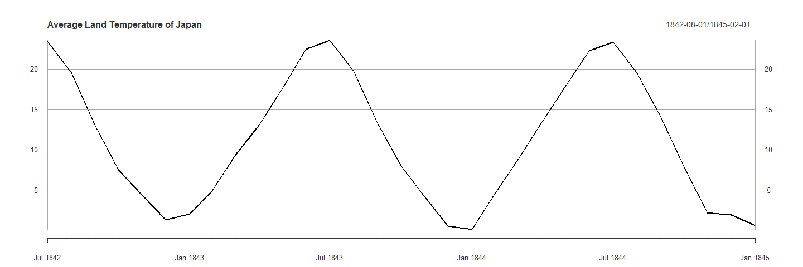<!-- -->

3.  Train Test Split

``` r
n= dim(global_temp_jpn_ts)[1]
trn_n= floor(n*0.8)

train= global_temp_jpn_ts[1:trn_n, ]
dim(train)
```

    ## [1] 1657    2

``` r
test= global_temp_jpn_ts[(trn_n+1):n, ]
dim(test)
```

    ## [1] 415   2

4.  Analyzing TS data and Finding the best model and parameters

``` r
acf2(train$AverageTemperature, 
     main= "ACF and PACF plots of Temperature before Seasonal without Differencing")
```

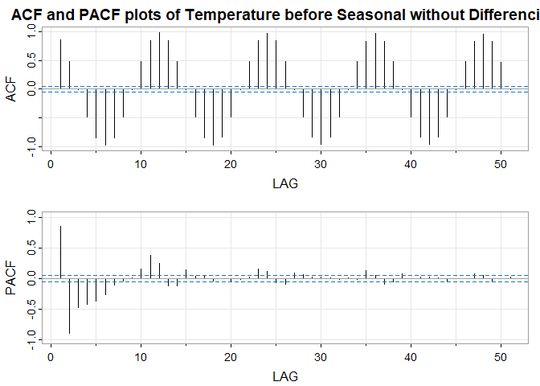<!-- -->

``` r
# Difference Data

diff= diff(global_temp_jpn_ts$AverageTemperature, 1)
acf2(diff, 
     main = "ACF and PACF plots of Temperature after Seasonal Differencing (1)")
```

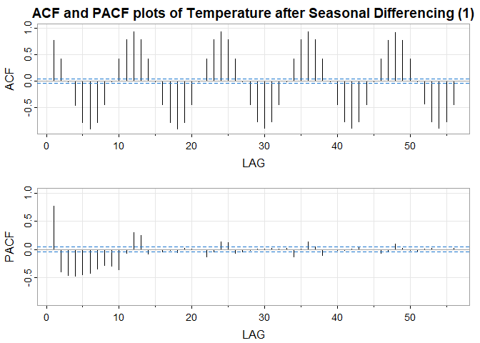<!-- -->

``` r
diff2= diff(global_temp_jpn_ts$AverageTemperature, 12)
acf2(diff2, 
     main = "ACF and PACF plots of Temperature after Seasonal Differencing (12)")
```

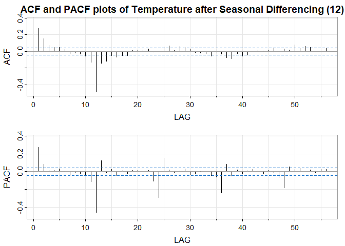<!-- -->

After analyzinf the above plot, the possible p, d, q and P, D, Q are p=
1, 2 d= 0, 1 q= 0, 1, 2

P= 2, 3, 4 D= 0, 1 Q= 0, 1

S= 12

``` r
p= c(1, 2)
d= c(0, 1)
q= c(0, 1, 2)

P= c(2, 3, 4)
D= c(0, 1)
Q= c(0, 1)

for (i in p){
  
  for (j in d){
    
    for (k in q){
      
      for (l in P){
        
        for (m in D){
          
          for (n in Q){
            
            tryCatch({
              
              print(paste(i, j, k, l, m , n, sep = ","))
              sarima(train$AverageTemperature, i, j, k, l, m, n, 12)
              
            }, error=function(e){cat("ERROR :",conditionMessage(e), "\n")})
            
          }
          
        }
        
      }
      
    }
    
  }
  
}
```

    ## Warning in arima(xdata, order = c(p, d, q), seasonal = list(order = c(P, :
    ## possible convergence problem: optim gave code = 1

<!-- --><!-- --><!-- --><!-- --><!-- -->

    ## Warning in sqrt(diag(fitit$var.coef)): NaNs produced

    ## Warning in sqrt(diag(fitit$var.coef)): NaNs produced

<!-- -->

    ## Warning in sqrt(diag(fitit$var.coef)): NaNs produced

    ## Warning in sqrt(diag(fitit$var.coef)): NaNs produced

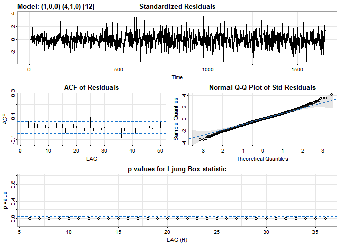<!-- -->

    ## Warning in sqrt(diag(fitit$var.coef)): NaNs produced

    ## Warning in sqrt(diag(fitit$var.coef)): NaNs produced

    ## Warning in arima(xdata, order = c(p, d, q), seasonal = list(order = c(P, :
    ## possible convergence problem: optim gave code = 1

<!-- --><!-- --><!-- --><!-- --><!-- --><!-- -->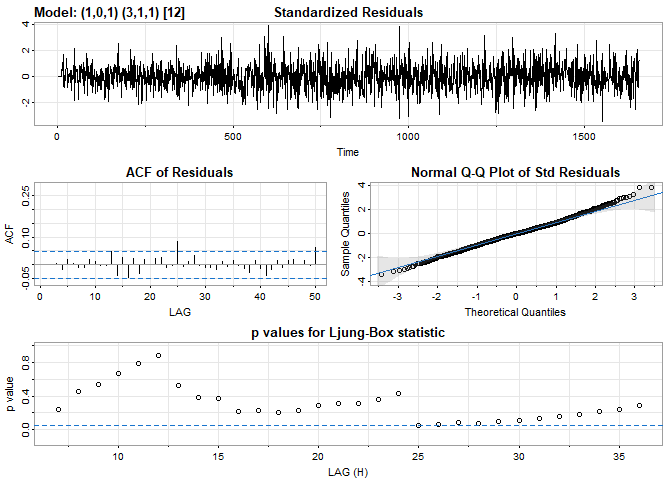<!-- -->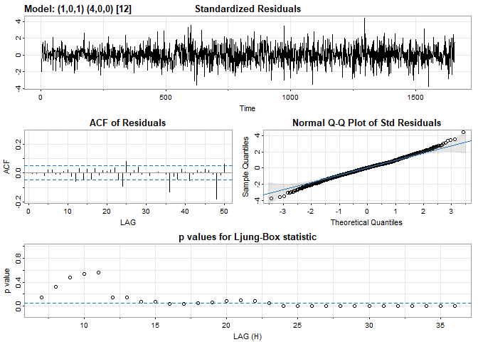<!-- --><!-- --><!-- --><!-- -->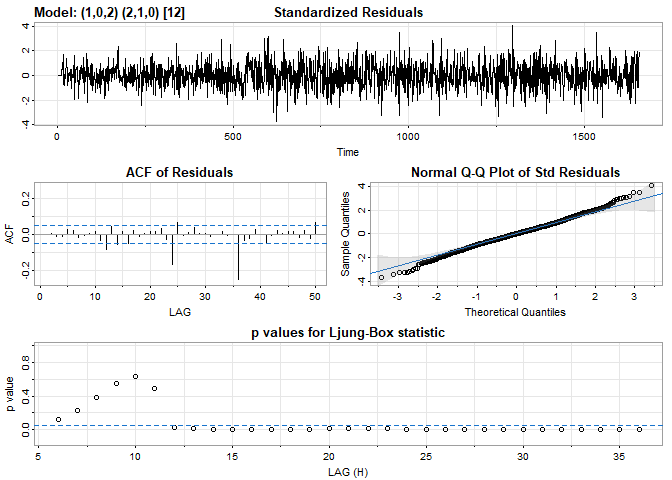<!-- --><!-- --><!-- --><!-- --><!-- --><!-- --><!-- --><!-- -->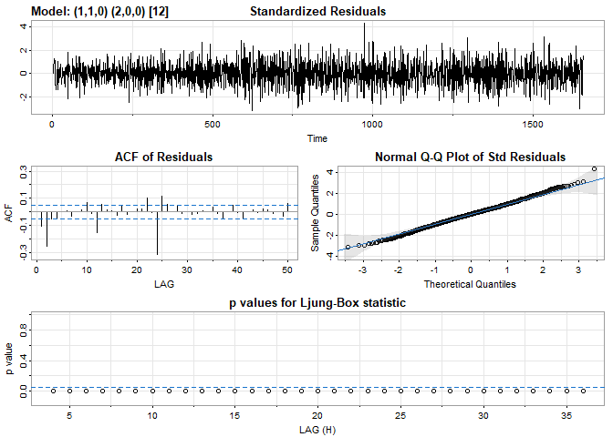<!-- -->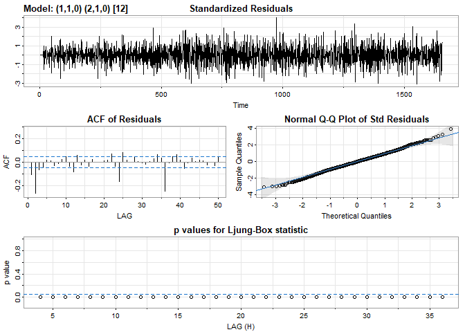<!-- --><!-- -->

    ## Warning in log(s2): NaNs produced

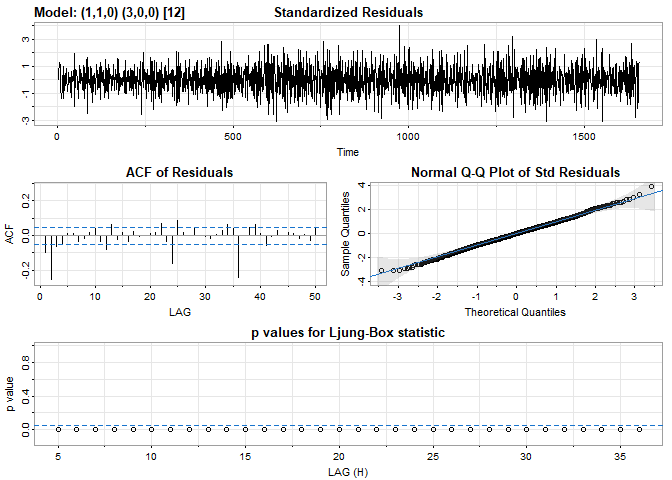<!-- --><!-- -->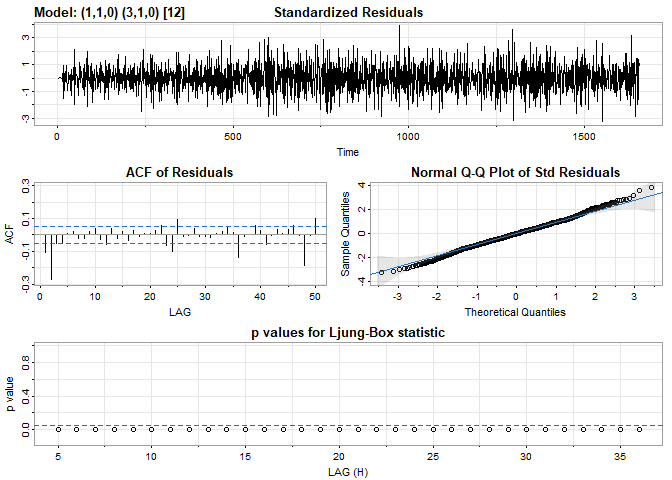<!-- --><!-- --><!-- --><!-- --><!-- -->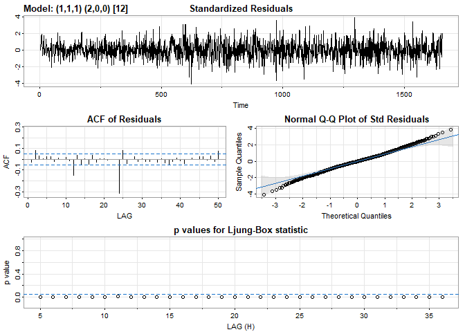<!-- -->

    ## Warning in log(s2): NaNs produced

    ## Warning in log(s2): NaNs produced

    ## Warning in log(s2): NaNs produced

    ## Warning in log(s2): NaNs produced

<!-- --><!-- -->

    ## Warning in sqrt(diag(fitit$var.coef)): NaNs produced

    ## Warning in sqrt(diag(fitit$var.coef)): NaNs produced

<!-- --><!-- -->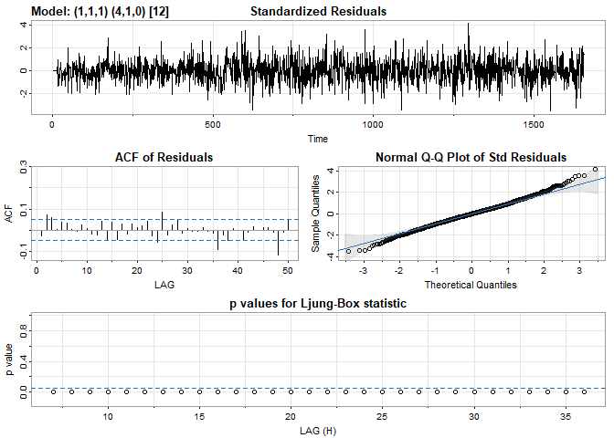<!-- --><!-- --><!-- --><!-- --><!-- --><!-- -->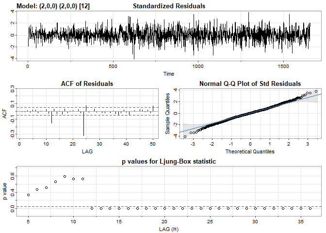<!-- --><!-- --><!-- -->

    ## Warning in sqrt(diag(fitit$var.coef)): NaNs produced

    ## Warning in sqrt(diag(fitit$var.coef)): NaNs produced

<!-- --><!-- --><!-- -->

    ## Warning in sqrt(diag(fitit$var.coef)): NaNs produced

    ## Warning in sqrt(diag(fitit$var.coef)): NaNs produced

<!-- -->

    ## Warning in sqrt(diag(fitit$var.coef)): NaNs produced

    ## Warning in sqrt(diag(fitit$var.coef)): NaNs produced

<!-- -->

    ## Warning in sqrt(diag(fitit$var.coef)): NaNs produced

    ## Warning in sqrt(diag(fitit$var.coef)): NaNs produced

<!-- --><!-- -->

    ## Warning in arima(xdata, order = c(p, d, q), seasonal = list(order = c(P, :
    ## possible convergence problem: optim gave code = 1

<!-- --><!-- -->

    ## Warning in sqrt(diag(fitit$var.coef)): NaNs produced

    ## Warning in sqrt(diag(fitit$var.coef)): NaNs produced

<!-- -->

    ## Warning in sqrt(diag(fitit$var.coef)): NaNs produced

    ## Warning in sqrt(diag(fitit$var.coef)): NaNs produced

    ## Warning in arima(xdata, order = c(p, d, q), seasonal = list(order = c(P, :
    ## possible convergence problem: optim gave code = 1

<!-- -->

    ## Warning in sqrt(diag(fitit$var.coef)): NaNs produced

    ## Warning in sqrt(diag(fitit$var.coef)): NaNs produced

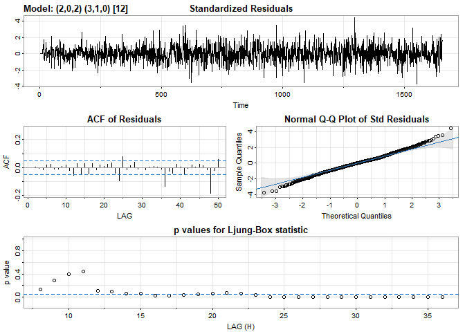<!-- --><!-- --><!-- --><!-- -->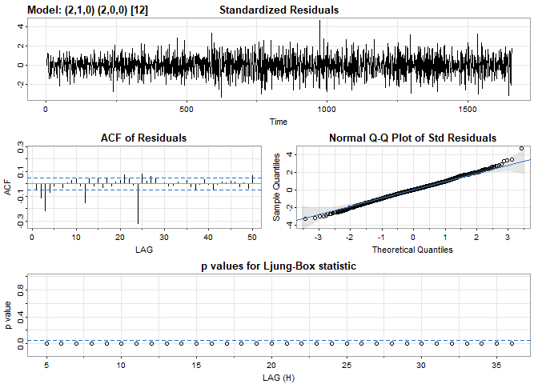<!-- --><!-- --><!-- -->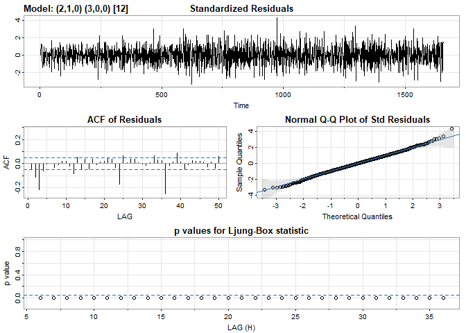<!-- --><!-- --><!-- --><!-- --><!-- --><!-- -->

    ## Warning in sqrt(diag(fitit$var.coef)): NaNs produced

    ## Warning in sqrt(diag(fitit$var.coef)): NaNs produced

<!-- --><!-- --><!-- -->

    ## Warning in sqrt(diag(fitit$var.coef)): NaNs produced

    ## Warning in sqrt(diag(fitit$var.coef)): NaNs produced

    ## Warning in log(s2): NaNs produced

    ## Warning in log(s2): NaNs produced

    ## Warning in log(s2): NaNs produced

    ## Warning in log(s2): NaNs produced

    ## Warning in log(s2): NaNs produced

<!-- -->

    ## Warning in sqrt(diag(fitit$var.coef)): NaNs produced

    ## Warning in sqrt(diag(fitit$var.coef)): NaNs produced

<!-- -->

    ## Warning in sqrt(diag(fitit$var.coef)): NaNs produced

    ## Warning in sqrt(diag(fitit$var.coef)): NaNs produced

    ## Warning in log(s2): NaNs produced

<!-- -->

    ## Warning in sqrt(diag(fitit$var.coef)): NaNs produced

    ## Warning in sqrt(diag(fitit$var.coef)): NaNs produced

<!-- -->

After analyzing the above plots, the possible parameters are - 211211 -
202411 - 202311 - 201211 - 200311 - 200211 - 102211

``` r
sarima(train$AverageTemperature, 2, 1, 1, 2, 1, 1, 12)
```

<!-- -->

``` r
sarima(train$AverageTemperature, 2, 0, 2, 4, 1, 1, 12)
```

<!-- -->

``` r
sarima(train$AverageTemperature, 2, 0, 2, 3, 1, 1, 12)
```

<!-- -->

``` r
sarima(train$AverageTemperature, 2, 0, 2, 4, 1, 1, 12)
```

<!-- -->

``` r
sarima(train$AverageTemperature, 1, 0, 1, 2, 1, 0, 12)
```

<!-- -->

``` r
# After analyzing the above plots, the best combinations could be 2, 0, 2, 4, 1, 1 or 1, 0, 1, 2, 1, 0

tst_n= dim(test)
pred= sarima.for(train$AverageTemperature, n.ahead =tst_n, 2, 0, 2, 4, 1, 1, 12)
```

    ## Warning in (n + 1):(n + n.ahead): numerical expression has 2 elements: only the
    ## first used

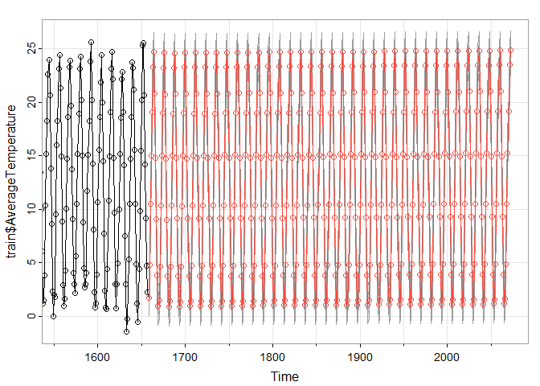<!-- -->

``` r
accuracy(object= pred$pred, test$AverageTemperature)
```

    ##                 ME     RMSE       MAE      MPE    MAPE
    ## Test set 0.2118279 1.027029 0.8239042 9.610925 28.1296

``` r
pred= sarima.for(train$AverageTemperature, n.ahead =tst_n, 1, 0, 1, 2, 1, 0, 12)
```

    ## Warning in (n + 1):(n + n.ahead): numerical expression has 2 elements: only the
    ## first used

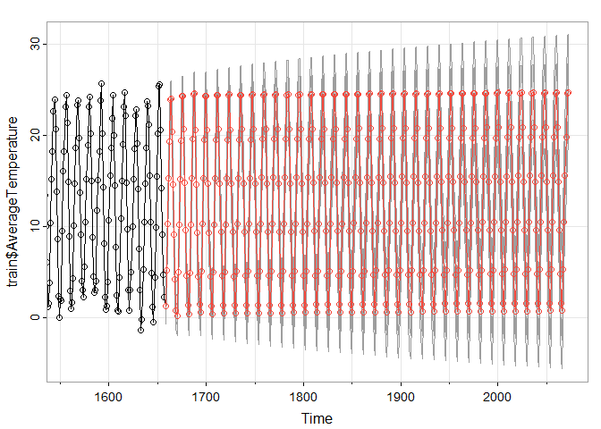<!-- -->

``` r
accuracy(object= pred$pred, test$AverageTemperature)
```

    ##                  ME     RMSE       MAE      MPE     MAPE
    ## Test set 0.01296256 1.169159 0.8991349 14.13005 28.91847

5.  Forecast the next 5 months

``` r
temperature= ts(global_temp_jpn_ts$AverageTemperature, 
                start= c(1841,1), end = c(2013, 08), frequency = 12)

forecast= sarima.for(temperature, n.ahead =5, 2, 0, 2, 4, 1, 1, 12)
```

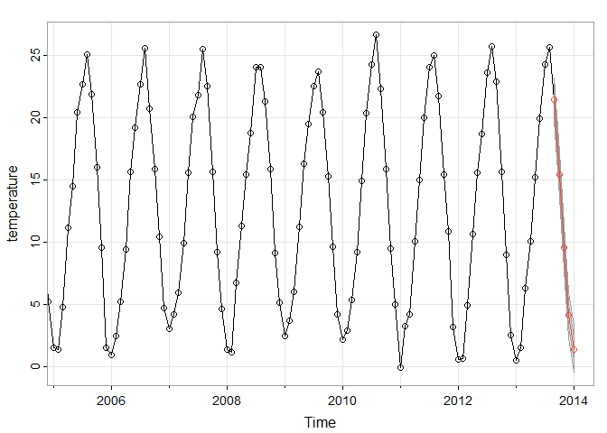<!-- -->
